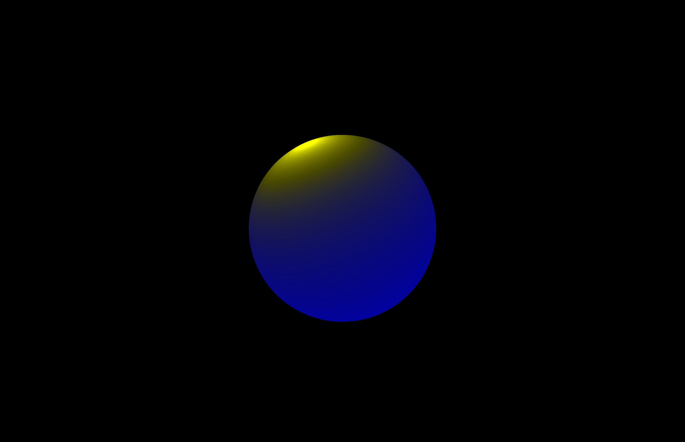
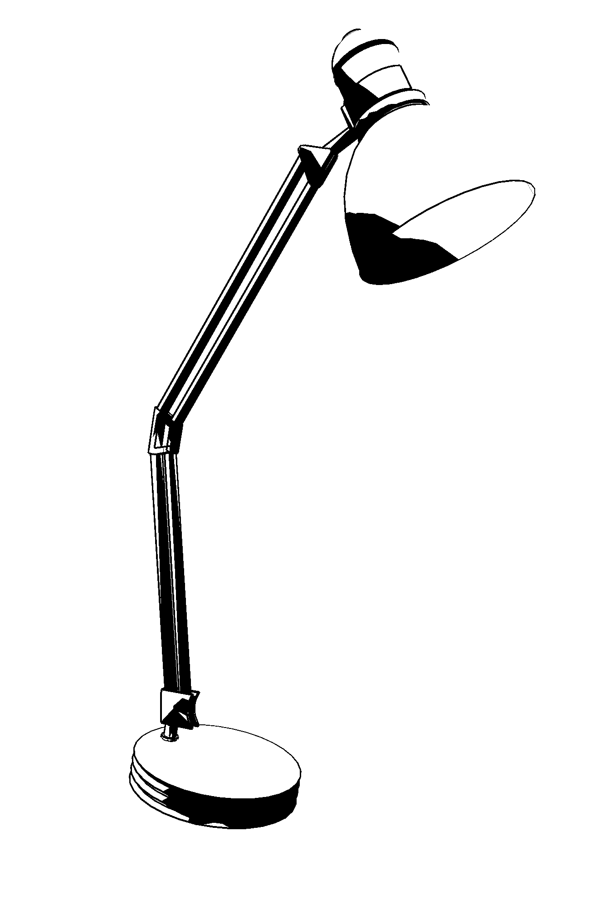

# NPR Studio
A lightweight real-time non-photorealistic renderer built with OpenGL. 

This project started as the final project of MIT's 6.4400 - "Computer Graphics" course but was extended afterward.

## Table of Contents

| [Features](#features) - [Gallery](#gallery) -  [Installing](#installing) - [Usage](#usage) - [Project Writeup](#project-writeup)| 
| :----------------------------------------------------------: |
| [High-Level Code Organization](#high-level-code-organization) - [Editing Code](#editing-code) - [Credits](#credits) - [Dependencies](#dependencies)|

## Features

* Opening .obj files (with attached .mtl files supported)
  * Currently, only the diffuse color from .mtl files is used for rendering.
  * If no .mtl file with diffuse colors is specified, then default colors are used to render the .obj mesh.
* Shading meshes with a Tone Mapping or Cartoon (Toon) shader
  * Custom colors can be specified for the illuminated/shadow colors of each shader.
* Rendering the silhouette, crease, and/or border edges of an object
  * Editable outline thickness and color
  * Option to render edges with miter joins between them for cleaner rendering
* Lighting meshes with either a directional or point light
* Custom background color (including transparent)
* Showing/hiding mesh to see outlines (wireframe mode)
* Rendering to file (png/jpg/bmp/tga)
  * For file formats that support it, a transparent background color will allow you to render an object without a background.
* Saving/Loading Rendering Presets

## Gallery
| | |
|--|--|
| |  |
|   | |
| | |
|  |  |

## Installing
*(Section partially adapted from an MIT 6.4400 assignment handout)*

This application requires a minimum version of OpenGL 3.3. You may have to update your graphics drivers.

This application uses C++ 11.

To install NPR Studio, first **download the source code of this project as a .zip** and extract it in the directory you want to run it in.

### Installing Build Tools

This project requires CMake, g++, and other building tools for compiling C++. They can be installed for various Operating Systems as follows:

#### Linux
```Shell
sudo apt-get install g++-5 build-essential cmake
```
#### MacOS
1. Install Xcode
2. Install Xcode command-line tools:
```Shell
xcode-select --install
```
3. Use [homebrew](https://brew.sh/) to install CMake:
```Shell
brew update
brew install cmake
```
#### Windows
1. Download the [CMake Windows installer](https://cmake.org/download/).
2. Download the newest version of Visual Studio (the community version is free at https://visualstudio.microsoft.com/vs/), and install the necessary C++ tools through Visual Studio (or in your preferred way).

### Building
#### Linux / MacOS
Run the following commands at the project's root directory:
```Shell
mkdir build
cd build
cmake ..  -DCMAKE_BUILD_TYPE=Release
make
```
#### Windows
You can use CMake-GUI to generate the build system of your choice:
1. Set the source code location ("Where is the source code") to the project's root directory
2. Set the binary building location ("Where to build the binaries") to the root directory followed by build/.
3. Click "Configure". The default configuration should suffice.
4. After configuring, click "Generate".
5. The build system files should be in the build directory.
6. Open the NPR_STUDIO.slr file with Visual Studio, and build the solution with the build type with the solution configuration set to "RELEASE".

After building the project, you should see an executable in the `build/Release` directory called "npr_studio". This is the application executable.

## Usage
### Normal Execution
All built executable files (i.e. UNIX executable, MacOSX .app) can be clicked on to open the application, but unix executable file. Models can be loaded from the application GUI.

Note that for a MacOSX app, the models/presets/renders directories are inside of the app itself (found by clicking "show package contents" on the app).

With a UNIX executable, the application can also be run from the command line:

### Running From the command line
To open an .obj file for rendering, run the application executable in the command line with the following syntax:

```Shell
./npr_studio <filename>
```

The specified filename begins from the [`assets/models`](./assets/models/) directory and supports child folders. To render your own model, place it in that directory.

For example, the [sponza palace](./assets/models/sponza_low) scene can be opened by running `./npr_studio sponza_low/sponza_norm.obj`.

If you don't specify a filename, a default mesh will be used for rendering.

### File Saving

Rendered images and render presets will be in the `assets/renders` and `assets/presets` directories, respectively. Note that rendering currently takes a screenshot of the application window, and (unfortunately) doesn't let you specify a resolution.

### Interacting with the Application

To move around the scene, click and drag the left mouse button for orbiting, right mouse button/scroll wheel for zooming, and middle mouse button (or shift + click and drag left mouse button) to move.

### Rendering your own Model

When exporting your model, ensure that the .obj mesh is properly triangulated. This can be done in Blender by checking the "Triangulated Mesh" option in the .obj exporter.

The application will calculate its own normals for the .obj file if none are specified. I've found that importing models exported with custom normals from Blender doesn't work well. If you want to keep your custom normals on your object, apply an "edge split" modifier to your object in Blender before exporting. Feel free to try getting it to work with the 3D software of your choice though.

If you want to render your own .obj model with custom colors, ensure that the color you want to appear in the renderer is part of the model's **diffuse** component. Ensure that the .obj file has a material group for each of the object's materials (no material groups means that the object is rendered without its own custom colors). This can be done in Blender by checking the "Material Groups" option in the .obj exporter.

When rendering a model with custom colors, you can tell the renderer to pull from the model's diffuse color by clicking the "Reset Colors to Material Diffuse" button. You can also override the model's diffuse colors manually by setting the "illumination" and "shadow" colors in the renderer.

Textures are currently unsupported, and if your model has textures, either remove them from the model's .mtl file or copy the texture files to the model directory and relatively link to them so the .obj importer doesn't break.

## Editing Code
If you add files, be sure to rerun `cmake` running `make`.

## High-Level Code Organization
The main entry point of this code is [`main`](./main_code/npr_studio/main.cpp), which calls [`ToonViewerApp`](./main_code/npr_studio/ToonViewerApp.hpp), which sets up the application and GUI.

When importing a mesh, `ToonViewerApp` creates [`OutlineNode`](./main_code/npr_studio/OutlineNode.hpp)s that handle rendering both the mesh itself and rendering its outlines.

The mesh itself is shaded using the [`ToneMappingShader`](./gloo/shaders/ToneMappingShader.hpp) and [`ToonShader`](./gloo/shaders/ToonShader.hpp). 

Mesh outlines are rendered using the [`OutlineShader`](./gloo/shaders/OutlineShader.hpp) and [`MiterOutlineShader`](./gloo/shaders/MiterOutlineShader.hpp).

All shader files have associated GLSL fragment, vertex, and/or geometry shaders found in [`gloo/shaders/glsl`](./gloo/shaders/glsl/).

When rendering edges with miter joins, the list of rendered edges is broken into polylines that are rendered individually by `MiterOutlineShader`. The logic for this is in [`edgeutils`](./main_code/common/edgeutils.hpp).

Lighting is handled using [`SunNode`](./main_code/npr_studio/SunNode.hpp).

Note that GLOO itself is structured similarly to Unity's scripting API.

## Project Writeup
If you're interested in learning a bit about the algorithms in the project, I've created a writeup for this project, found [here](https://www.mit.edu/~obin/2023-2024/Semester_1/6_4400/final_project/writeup.pdf). Currently, it only touches on the work I've done up to December 13, 2023 (Toon/Tone Shading + Basic (Non-Miter) Outline Rendering).


## Credits
This application is built off of the library `GLOO` (openGL Object-Oriented), a lightweight object-oriented C++ library for interacting with OpenGL that was provided by MIT’s 6.4400 Course Staff (includes essentially all code from the first commit that's not the `/external` directory).

All NPR-specific code (stylized shaders, drawing outlines, application GUI, etc.) was created by Obi_Nnamdi.

### Dependencies
This project uses the libraries GLAD, GLFW, GLM, stb image, and Dear ImGui.